I build practical tooling around large language models. I care about what happens around a model call: what it costs, whether it stays in budget, and whether the output is structured enough to trust.

<table><tr><td valign="top" width="34%">

### Latest ships
<!-- ships:start -->
[tokenlens@8a0cb3a — Test --version flag](https://github.com/sharatchandrasai999-sketch/tokenlens/commit/8a0cb3ae89f74b6302eb2e24f6ee3bdd3ee9e317) · 2026-09-30

[tokenlens@149fd88 — Add --version flag to CLI](https://github.com/sharatchandrasai999-sketch/tokenlens/commit/149fd88594cb5ec67ff53d4d22d778512ead0873) · 2026-09-30

[tokenlens@12d75e2 — Revert --version test; implementation lands separately](https://github.com/sharatchandrasai999-sketch/tokenlens/commit/12d75e23d425efb197fcc78d40c165133ae20748) · 2026-09-30

[extracteval@cc719e9 — Restore leaderboard print in compare (+ regression test)](https://github.com/sharatchandrasai999-sketch/extracteval/commit/cc719e9de8a321547d3202e8de379421ad56454f) · 2026-09-30

[extracteval@854c53b — Test --version flag](https://github.com/sharatchandrasai999-sketch/extracteval/commit/854c53becb31c7d3409d172a5b1df66ab4bcb48e) · 2026-09-30

[extracteval@2497eea — Add --version flag to CLI](https://github.com/sharatchandrasai999-sketch/extracteval/commit/2497eea3f57d72d9721a9ce766bf757f5d857755) · 2026-09-30
<!-- ships:end -->
</td><td valign="top" width="33%">

### Open source
<!-- oss:start -->
[simonw/llm#1726](https://github.com/simonw/llm/pull/1726) — **open**

_Raise ValueError when a model returns the wrong number of embeddings_

Validates embedding counts per batch (a model returning the wrong count used to silently drop entries) plus three regression tests.
<!-- oss:end -->
</td><td valign="top" width="33%">

### The toolkit
**[tokenlens](https://github.com/sharatchandrasai999-sketch/tokenlens)** — know what an LLM request costs before you send it. Counts tokens, prices across models, guards budgets.

**[extracteval](https://github.com/sharatchandrasai999-sketch/extracteval)** — measure whether structured output is actually right. Type-aware scoring, multi-model leaderboard.

</td></tr></table>

<!-- stats:start -->
**65** tests passing across both repos · **16+** models priced in tokenlens · tokenlens **v0.2.0** · **1** upstream PR to simonw/llm
<!-- stats:end -->

## About me

tokenlens came out of wanting to understand a request's cost before sending it; extracteval out of needing structured output I can actually measure and compare across models. If you're reviewing my work, start with **tokenlens** for LLM developer tooling and **extracteval** for structured-output evaluation.

## Contact

- **Portfolio:** [sharatchandrasai999-sketch.github.io](https://sharatchandrasai999-sketch.github.io)
- **LinkedIn:** [sharat-chandra-sai-boddu-6504673a6](https://www.linkedin.com/in/sharat-chandra-sai-boddu-6504673a6)
- **Email:** sharatchandrasai999@gmail.com

---
This page rebuilds itself every Monday from my public GitHub activity — <a href="https://github.com/sharatchandrasai999-sketch/sharatchandrasai999-sketch/actions">how it works</a>.
