<!-- stats:start -->
**65** tests passing · **16+** models priced · tokenlens **v0.2.0** · **1** upstream OSS contribution
<!-- stats:end -->

## Built

### [tokenlens](https://github.com/sharatchandrasai999-sketch/tokenlens) 

Know what an LLM request costs before you send it. Exact token counting, cross-model pricing, budget guardrails, and a prompt linter — as a CLI, API, and dashboard.

### [extracteval](https://github.com/sharatchandrasai999-sketch/extracteval) 

Measure whether structured output is actually right. Configure an extraction task in one YAML file, score it with type-aware metrics, and compare models on a leaderboard.

## Upstream

<!-- oss:start -->
[**simonw/llm#1726**](https://github.com/simonw/llm/pull/1726) — open

Per-batch embedding-count validation: a model returning the wrong number of embeddings used to have entries silently dropped — now it fails loudly, with three regression tests.
<!-- oss:end -->

## Now

Building eval tooling, keeping both repos green, and looking for ML/AI engineer roles.

## Elsewhere

**Portfolio:** [sharatchandrasai999-sketch.github.io](https://sharatchandrasai999-sketch.github.io) ·
**LinkedIn:** [sharat-chandra-sai-boddu-6504673a6](https://www.linkedin.com/in/sharat-chandra-sai-boddu-6504673a6) ·
**Email:** sharatchandrasai999@gmail.com
